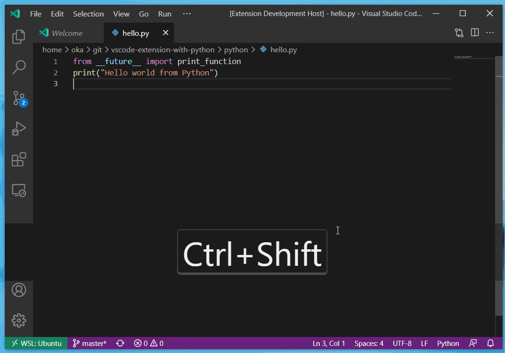

# vscode-extension-with-python

This is an example for running a Python script inside a VSCode extension using the Node.js package [python-shell](https://www.npmjs.com/package/python-shell).

## Features

Open command palette, then run `Hello World`.

## Requirements

This extension needs Python installed.

## Extension Settings

Currently, no settings are available.

## Known Issues

..

## Release Notes

..
